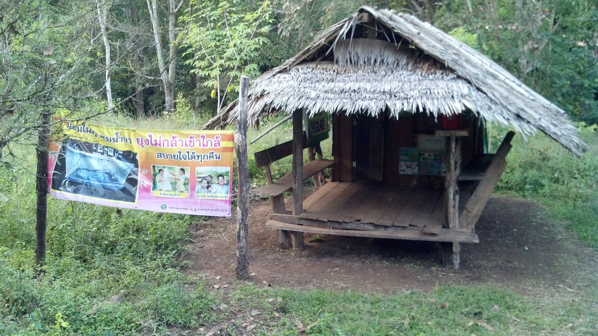

# Early Diagnosis and Treatment — Borderland & Community-Based Malaria Care

**What this is:**  
This repository documents the development, evidence base, and operational lessons from **early diagnosis and treatment (EDT)** strategies for malaria in borderland and hard-to-reach settings, with a focus on **malaria posts (MPs)** and other forms of community-based care.  

**Why it’s here:**  
While targeted mass drug administration (tMDA) and other interventions can have short-term impacts, sustained malaria control and elimination require long-term, accessible, and community-supported diagnosis and treatment systems. EDT has proven to be less controversial, more sustainable, and often easier to implement than tMDA — provided it is done well and consistently.  

*Photo: Taken by D.M. Parker in 2013, Thasongyang District, Thailand.*

---

## Why this matters

- **Challenge:** Remote, mobile, and marginalized populations often face the highest malaria burdens yet have the least access to quality diagnosis and treatment.  
- **Evidence base:** Studies from the [Shoklo Malaria Research Unit (SMRU)](https://www.shoklo-unit.com/) and partners demonstrated that **malaria posts** — small, community-run points of care with rapid diagnostic tests and antimalarials — can drastically reduce malaria morbidity and mortality.  
- **Key insight:** Malaria posts, when properly set up and properly functioning, can bring treatment within reach for communities where health facilities are distant or inaccessible. For falciparum malaria this can lead to reduced transmission. The same may be true for other infections.  
- **Operational advantage:** EDT integrates easily with other community health priorities and supports sustained malaria control and elimination efforts, even in challenging political and geographic contexts.  

---

## Historical foundations

- **Deployment of early diagnosis and mefloquine–artesunate treatment of falciparum malaria in Thailand: The Tak Malaria Initiative.**  
  Carrara VI, Sirilak S, Thonglairuam J, Rojanawatsirivet C, Proux S, Gilbos V, Ashley EA, McGready R, White NJ, Nosten F. *PLoS Medicine*. 2006;3(6):e183.  
  [https://doi.org/10.1371/journal.pmed.0030183](https://doi.org/10.1371/journal.pmed.0030183)  
  Demonstrated dramatic reductions in *P. falciparum* morbidity and mortality via community-based diagnosis and ACT treatment among displaced populations in Tak Province, Thailand.

- **Effect of early detection and treatment on malaria-related maternal mortality on the north-western border of Thailand (1986–2010).**  
  McGready R, Boel M, Rijken MJ, Ashley EA, Cho T, et al. *PLoS ONE*. 2012;7(7):e40244.  
  [https://doi.org/10.1371/journal.pone.0040244](https://doi.org/10.1371/journal.pone.0040244)  
  Showed that frequent antenatal clinic screening and early treatment of **P. falciparum** infections reduced maternal mortality significantly in refugee and migrant populations served by SMRU.

---

## Broader relevance & future directions

- Extending EDT principles to **non-malaria febrile illness** management in remote areas.  
- Integrating EDT with **maternal and child health services**.  
- Exploring **digital reporting tools** for faster case detection and response.  
- Applying EDT approaches in **urban/peri-urban hotspots** for other diseases.  

---

## Related repositories

- [METF-mapping](https://github.com/DMParker1/METF-mapping) — Mapping and community engagement groundwork for malaria post placement and METF operations.  
- [tMDA-program](https://github.com/DMParker1/tmda-program) — Targeted mass drug administration trials and modeling in Southeast Asia.  
- [tm-border-mch](https://github.com/DMParker1/tm-border-mch) — Maternal and child health research on the Thailand–Myanmar border.  
- [earth-observation-labs](https://github.com/DMParker1/earth-observation-labs) — Remote sensing and Earth observation methods applied to public health.  

---

## Notes on Data & Ethics

- Any requests for data from these projects should be directed to the [Mahidol–Oxford Tropical Medicine Research Unit (MORU)](https://www.tropmedres.ac/).  
- No sensitive data are included in this repository.  
